# Threat Model Report — unknown

> Generated: 2026-04-22T21:58:42.332Z  
> Files scanned: 64 | Annotations: 310
> GuardLink version: 1.4.1
> Commit: 7d3fe7bb72448d96e829273e29fcf7e5bfde7406 (feat/v1.5.0)

## Application Overview

# guardlink — Project Description

<!-- This file feeds into `guardlink report` as the Application Overview section. -->
<!-- Fill it in manually, or let `guardlink annotate` generate it with AI assistance. -->

## What This Application Does

<!-- Brief description: what does the project do, who are its users? -->

## Key Components

<!-- List the major modules, services, or subsystems (e.g., API server, auth service, worker queue). -->

## Trust Boundaries

<!-- Where does trust change? e.g., public internet → API gateway, app → database, app → third-party API. -->

## Data Sensitivity

<!-- What sensitive data does this project handle? (PII, credentials, financial data, health records, etc.) -->

## Deployment Context

<!-- How and where is this deployed? (cloud provider, containerized, on-prem, CI/CD pipeline, etc.) -->

**Risk posture at a glance:**

| Indicator | Value |
|-----------|-------|
| Exposure coverage | 79% addressed (48 mitigated, 0 accepted) |
| Unmitigated exposures | 16 (1 critical, 4 high, 6 medium, 5 low) |
| Trust boundaries | 9 |
| Data flows tracked | 75 |
| AI/ML components | Yes |

## Scope of This Threat Model

This threat model covers **16 assets** and **15 threat categories** derived from **310 annotations** across **42** of **64** source files.

### Assets in Scope

- `parser` — Reads source files from disk, extracts security annotations using regex patterns
- `cli` — Command-line interface, handles user arguments, invokes subcommands
- `tui` — Interactive terminal interface with readline input and command dispatch
- `mcp` — Model Context Protocol server, accepts tool calls from AI agents over stdio
- `llm-client` — Makes HTTP requests to external AI providers (Anthropic, OpenAI, DeepSeek, Open…
- `dashboard` — Generates interactive HTML threat model dashboard from ThreatModel data
- `init` — Initializes projects, writes config files and agent instruction files to disk
- `agent-launcher` — Spawns child processes for AI coding agents (Claude Code, Cursor, Codex)
- `diff` — Compares threat models across git commits, invokes git commands
- `report` — Generates markdown threat model reports with Mermaid diagrams
- `sarif` — Exports findings as SARIF 2.1.0 JSON for security tooling
- `suggest` — Analyzes code patterns to suggest appropriate security annotations
- `workspace-link` — Multi-repo workspace linking setup
- `merge-engine` — Cross-repo threat model unification
- `report-metadata` — Report provenance data
- `workspace-config` — Multi-repo workspace definition

### Threat Categories Addressed

- **path_traversal** (high)
- **command_injection** (critical)
- **cross_site_scripting** (high)
- **api_key_exposure** (high)
- **server_side_request_forgery** (medium)
- **redos** (medium)
- **arbitrary_file_write** (high)
- **prompt_injection** (medium)
- **denial_of_service** (medium)
- **sensitive_data_exposure** (medium)
- **insecure_deserialization** (medium)
- **child_process_injection** (high)
- **information_disclosure** (low)
- **tag_collision** (medium)
- **config_tampering** (medium)

### Coverage

- **42** of **64** files have security annotations (66%)
- **22** files have no annotations

## Architecture

### Components

| Component | ID | Description | Defined At |
|-----------|-----|-------------|------------|
| GuardLink.Parser | parser | Reads source files from disk, extracts security a… | .guardlink/definitions.ts:15 |
| GuardLink.CLI | cli | Command-line interface, handles user arguments, i… | .guardlink/definitions.ts:16 |
| GuardLink.TUI | tui | Interactive terminal interface with readline inpu… | .guardlink/definitions.ts:17 |
| GuardLink.MCP | mcp | Model Context Protocol server, accepts tool calls… | .guardlink/definitions.ts:18 |
| GuardLink.LLM_Client | llm-client | Makes HTTP requests to external AI providers (Ant… | .guardlink/definitions.ts:19 |
| GuardLink.Dashboard | dashboard | Generates interactive HTML threat model dashboard… | .guardlink/definitions.ts:20 |
| GuardLink.Init | init | Initializes projects, writes config files and age… | .guardlink/definitions.ts:21 |
| GuardLink.Agent_Launcher | agent-launcher | Spawns child processes for AI coding agents (Clau… | .guardlink/definitions.ts:22 |
| GuardLink.Diff | diff | Compares threat models across git commits, invoke… | .guardlink/definitions.ts:23 |
| GuardLink.Report | report | Generates markdown threat model reports with Merm… | .guardlink/definitions.ts:24 |
| GuardLink.SARIF | sarif | Exports findings as SARIF 2.1.0 JSON for security… | .guardlink/definitions.ts:25 |
| GuardLink.Suggest | suggest | Analyzes code patterns to suggest appropriate sec… | .guardlink/definitions.ts:26 |
| Workspace.Link | workspace-link | Multi-repo workspace linking setup | src/workspace/link.ts:7 |
| Workspace.Merge | merge-engine | Cross-repo threat model unification | src/workspace/merge.ts:7 |
| Workspace.Metadata | report-metadata | Report provenance data | src/workspace/metadata.ts:7 |
| Workspace.Config | workspace-config | Multi-repo workspace definition | src/workspace/types.ts:7 |

### Entrypoints

Assets receiving external input:

- **#agent-launcher**: EnvVars via process.env, ConfigFile via readFileSync, UserPrompt via launchAgent, AgentProcess via stdout, UserPrompt via buildAnnotatePrompt, UserPrompt via buildTranslatePrompt, UserPrompt via buildAskPrompt, ThreatModel via model
- **#llm-client**: ThreatModel via serializeModel, ProjectFiles via readFileSync, PentestFindings via readFileSync, LLMConfig via chatCompletion, LLMProvider via response, LLMToolCall via createToolExecutor, ProjectFiles via readFileSync
- **#cli**: UserArgs via process.argv, ThreatModel via getReviewableExposures
- **#dashboard**: ThreatModel via generateThreatGraph, ThreatModel via generateTopologyData, ThreatModel via computeStats, ThreatModel via topologyData, SourceFiles via readFileSync, ThreatModel via generateDashboardHTML
- **#init**: ProjectRoot via detectProject, ProjectRoot via options.root
- **#mcp**: MCPClient via stdio, QueryString via lookup, MCPClient via tool_call
- **#suggest**: FilePath via readFileSync
- **#parser**: ProjectRoot via fast-glob, FilePath via readFile, ProjectRoot via fast-glob
- **#sarif**: ThreatModel via generateSarif
- **#diff**: GitRef via execSync, GitRef via parseAtRef
- **#report**: ThreatModel via generateReport, ThreatModel via generateSequenceDiagram
- **#tui**: UserArgs via args, ConfigFile via loadProjectConfig, UserInput via readline, RawStdin via process.stdin
- **#workspace-link**: UserArgs via linkProject
- **#merge-engine**: ReportJSON via mergeReports
- **#report-metadata**: GitRepo via execSync

### External Callers

- **EnvVars** → #agent-launcher
- **ConfigFile** → #agent-launcher, #tui
- **UserPrompt** → #agent-launcher
- **AgentProcess** → #agent-launcher
- **ThreatModel** → #agent-launcher, #llm-client, #dashboard, #sarif, #report, #cli
- **ProjectFiles** → #llm-client
- **PentestFindings** → #llm-client
- **LLMConfig** → #llm-client
- **LLMProvider** → #llm-client
- **LLMToolCall** → #llm-client
- **UserArgs** → #cli, #tui, #workspace-link
- **SourceFiles** → #dashboard
- **ProjectRoot** → #init, #parser
- **MCPClient** → #mcp
- **QueryString** → #mcp
- **FilePath** → #suggest, #parser
- **GitRef** → #diff
- **UserInput** → #tui
- **RawStdin** → #tui
- **ReportJSON** → #merge-engine
- **GitRepo** → #report-metadata

### Architecture Diagram

### Network Zones & Trust Boundaries

- **Trust boundary at process spawn**: agent-launcher ↔ AgentProcess
- **Trust boundary at external API call**: llm-client ↔ LLMProvider
- **Trust boundary at external API**: llm-client ↔ NVD
- **Trust boundary at CLI argument parsing**: cli ↔ UserInput
- **Trust boundary at MCP protocol**: mcp ↔ MCPClient
- **Trust boundary at tool argument parsing**: mcp ↔ MCPClient
- **Trust boundary between parser and disk I/O**: parser ↔ FileSystem
- **Trust boundary at git command execution**: diff ↔ GitRepo
- **Trust boundary at interactive input**: tui ↔ UserInput

### Multi-tenancy

_No multi-tenancy annotations found. If this is a multi-tenant application, consider adding `@comment` or `@boundary` annotations describing tenant isolation._

### Compliance

_No compliance-related annotations found._

## Key Flows & Sequence

### Sequence Diagram

```mermaid
sequenceDiagram
  participant EnvVars as EnvVars
  participant _agent_launcher as agent-launcher
  participant ConfigFile as ConfigFile [DB]
  actor UserPrompt as UserPrompt
  participant AgentProcess as AgentProcess
  participant ThreatModel as ThreatModel
  participant AgentPrompt as AgentPrompt
  actor _llm_client as llm-client
  participant ProjectFiles as ProjectFiles [DB]
  participant ReportFile as ReportFile [DB]
  participant PentestFindings as PentestFindings
  participant LLMConfig as LLMConfig [DB]
  participant LLMProvider as LLMProvider
  participant LLMToolCall as LLMToolCall
  participant NVD as NVD
  actor UserArgs as UserArgs
  participant _cli as cli
  participant FileSystem as FileSystem [DB]
  participant _dashboard as dashboard
  participant SourceFiles as SourceFiles [DB]
  participant HTML as HTML
  participant ProjectRoot as ProjectRoot
  participant _init as init
  participant AgentFiles as AgentFiles [DB]
  actor MCPClient as MCPClient
  participant _mcp as mcp
  participant QueryString as QueryString
  participant FilePath as FilePath [DB]
  participant _suggest as suggest
  participant Suggestions as Suggestions
  participant _parser as parser
  participant Annotations as Annotations
  participant _sarif as sarif
  participant SarifLog as SarifLog
  participant GitRef as GitRef
  participant _diff as diff
  participant TempDir as TempDir
  participant _report as report
  participant Markdown as Markdown
  participant _tui as tui
  actor UserInput as UserInput
  participant Commands as Commands
  participant RawStdin as RawStdin
  participant Terminal as Terminal
  participant _workspace_link as workspace-link
  participant ReportJSON as ReportJSON
  participant _merge_engine as merge-engine
  participant MergedReport as MergedReport
  participant GitRepo as GitRepo
  participant _report_metadata as report-metadata

  rect rgb(240, 248, 255)
  Note right of EnvVars: EnvVars
  EnvVars->>+_agent_launcher: process.env
  deactivate _agent_launcher
  end
  rect rgb(240, 248, 255)
  Note right of ConfigFile: ConfigFile
  ConfigFile->>+_agent_launcher: readFileSync
  _agent_launcher-->>-ConfigFile: writeFileSync
  ConfigFile->>+_tui: loadProjectConfig
  _tui-->>-ConfigFile: saveProjectConfig
  end
  rect rgb(240, 248, 255)
  Note right of _agent_launcher: agent-launcher
  _agent_launcher->>+ConfigFile: writeFileSync
  ConfigFile-->>-_agent_launcher: readFileSync
  _agent_launcher->>+AgentProcess: spawn
  AgentProcess-->>-_agent_launcher: stdout
  _agent_launcher->>+AgentPrompt: return
  deactivate AgentPrompt
  end
  rect rgb(240, 248, 255)
  Note right of UserPrompt: UserPrompt
  UserPrompt->>+_agent_launcher: launchAgent
  deactivate _agent_launcher
  UserPrompt->>+_agent_launcher: buildAnnotatePrompt
  deactivate _agent_launcher
  UserPrompt->>+_agent_launcher: buildTranslatePrompt
  deactivate _agent_launcher
  UserPrompt->>+_agent_launcher: buildAskPrompt
  deactivate _agent_launcher
  end
  rect rgb(240, 248, 255)
  Note right of AgentProcess: AgentProcess
  AgentProcess->>+_agent_launcher: stdout
  _agent_launcher-->>-AgentProcess: spawn
  end
  rect rgb(240, 248, 255)
  Note right of ThreatModel: ThreatModel
  ThreatModel->>+_agent_launcher: model
  deactivate _agent_launcher
  ThreatModel->>+_llm_client: serializeModel
  deactivate _llm_client
  ThreatModel->>+_dashboard: generateThreatGraph
  deactivate _dashboard
  ThreatModel->>+_dashboard: generateTopologyData
  deactivate _dashboard
  ThreatModel->>+_dashboard: computeStats
  deactivate _dashboard
  ThreatModel->>+_dashboard: topologyData
  deactivate _dashboard
  ThreatModel->>+_dashboard: generateDashboardHTML
  deactivate _dashboard
  ThreatModel->>+_sarif: generateSarif
  deactivate _sarif
  ThreatModel->>+_report: generateReport
  deactivate _report
  ThreatModel->>+_report: generateSequenceDiagram
  deactivate _report
  ThreatModel->>+_cli: getReviewableExposures
  deactivate _cli
  end
  rect rgb(240, 248, 255)
  Note right of ProjectFiles: ProjectFiles
  ProjectFiles->>+_llm_client: readFileSync
  deactivate _llm_client
  ProjectFiles->>+_llm_client: readFileSync
  deactivate _llm_client
  end
  rect rgb(240, 248, 255)
  Note right of _llm_client: llm-client
  _llm_client->>+ReportFile: writeFileSync
  deactivate ReportFile
  _llm_client->>+LLMProvider: fetch
  LLMProvider-->>-_llm_client: response
  _llm_client->>+NVD: fetch
  deactivate NVD
  end
  rect rgb(240, 248, 255)
  Note right of PentestFindings: PentestFindings
  PentestFindings->>+_llm_client: readFileSync
  deactivate _llm_client
  end
  rect rgb(240, 248, 255)
  Note right of LLMConfig: LLMConfig
  LLMConfig->>+_llm_client: chatCompletion
  deactivate _llm_client
  end
  rect rgb(240, 248, 255)
  Note right of LLMProvider: LLMProvider
  LLMProvider->>+_llm_client: response
  _llm_client-->>-LLMProvider: fetch
  end
  rect rgb(240, 248, 255)
  Note right of LLMToolCall: LLMToolCall
  LLMToolCall->>+_llm_client: createToolExecutor
  deactivate _llm_client
  end
  rect rgb(240, 248, 255)
  Note right of UserArgs: UserArgs
  UserArgs->>+_cli: process.argv
  deactivate _cli
  UserArgs->>+_tui: args
  deactivate _tui
  UserArgs->>+_workspace_link: linkProject
  deactivate _workspace_link
  end
  rect rgb(240, 248, 255)
  Note right of _cli: cli
  _cli->>+FileSystem: writeFile
  deactivate FileSystem
  _cli->>+SourceFiles: writeFile
  deactivate SourceFiles
  end
  rect rgb(240, 248, 255)
  Note right of SourceFiles: SourceFiles
  SourceFiles->>+_dashboard: readFileSync
  deactivate _dashboard
  end
  rect rgb(240, 248, 255)
  Note right of _dashboard: dashboard
  _dashboard->>+HTML: return
  deactivate HTML
  end
  rect rgb(240, 248, 255)
  Note right of ProjectRoot: ProjectRoot
  ProjectRoot->>+_init: detectProject
  deactivate _init
  ProjectRoot->>+_init: options.root
  deactivate _init
  ProjectRoot->>+_parser: fast-glob
  deactivate _parser
  ProjectRoot->>+_parser: fast-glob
  deactivate _parser
  end
  rect rgb(240, 248, 255)
  Note right of _init: init
  _init->>+AgentFiles: writeFileSync
  deactivate AgentFiles
  _init->>+ConfigFile: writeFileSync
  deactivate ConfigFile
  end
  rect rgb(240, 248, 255)
  Note right of MCPClient: MCPClient
  MCPClient->>+_mcp: stdio
  _mcp-->>-MCPClient: resource
  MCPClient->>+_mcp: tool_call
  _mcp-->>-MCPClient: resource
  end
  rect rgb(240, 248, 255)
  Note right of QueryString: QueryString
  QueryString->>+_mcp: lookup
  deactivate _mcp
  end
  rect rgb(240, 248, 255)
  Note right of _mcp: mcp
  _mcp->>+FileSystem: writeFile
  deactivate FileSystem
  _mcp->>+_llm_client: generateThreatReport
  deactivate _llm_client
  _mcp->>+MCPClient: resource
  MCPClient-->>-_mcp: stdio
  end
  rect rgb(240, 248, 255)
  Note right of FilePath: FilePath
  FilePath->>+_suggest: readFileSync
  deactivate _suggest
  FilePath->>+_parser: readFile
  deactivate _parser
  end
  rect rgb(240, 248, 255)
  Note right of _suggest: suggest
  _suggest->>+Suggestions: suggestAnnotations
  deactivate Suggestions
  end
  rect rgb(240, 248, 255)
  Note right of _parser: parser
  _parser->>+SourceFiles: writeFile
  deactivate SourceFiles
  _parser->>+Annotations: parseString
  deactivate Annotations
  _parser->>+ThreatModel: assembleModel
  deactivate ThreatModel
  end
  rect rgb(240, 248, 255)
  Note right of _sarif: sarif
  _sarif->>+SarifLog: return
  deactivate SarifLog
  end
  rect rgb(240, 248, 255)
  Note right of GitRef: GitRef
  GitRef->>+_diff: execSync
  deactivate _diff
  GitRef->>+_diff: parseAtRef
  deactivate _diff
  end
  rect rgb(240, 248, 255)
  Note right of _diff: diff
  _diff->>+TempDir: writeFileSync
  deactivate TempDir
  _diff->>+ThreatModel: parseProject
  deactivate ThreatModel
  end
  rect rgb(240, 248, 255)
  Note right of _report: report
  _report->>+Markdown: return
  deactivate Markdown
  end
  rect rgb(240, 248, 255)
  Note right of _tui: tui
  _tui->>+FileSystem: writeFile
  deactivate FileSystem
  _tui->>+_agent_launcher: launchAgent
  deactivate _agent_launcher
  _tui->>+_llm_client: chatCompletion
  deactivate _llm_client
  _tui->>+ConfigFile: saveProjectConfig
  ConfigFile-->>-_tui: loadProjectConfig
  _tui->>+Commands: dispatch
  deactivate Commands
  _tui->>+Terminal: process.stdout
  deactivate Terminal
  end
  rect rgb(240, 248, 255)
  Note right of UserInput: UserInput
  UserInput->>+_tui: readline
  deactivate _tui
  end
  rect rgb(240, 248, 255)
  Note right of RawStdin: RawStdin
  RawStdin->>+_tui: process.stdin
  deactivate _tui
  end
  rect rgb(240, 248, 255)
  Note right of _workspace_link: workspace-link
  _workspace_link->>+AgentFiles: updateAgentWorkspaceContext
  deactivate AgentFiles
  end
  rect rgb(240, 248, 255)
  Note right of ReportJSON: ReportJSON
  ReportJSON->>+_merge_engine: mergeReports
  deactivate _merge_engine
  end
  rect rgb(240, 248, 255)
  Note right of _merge_engine: merge-engine
  _merge_engine->>+MergedReport: mergeReports
  deactivate MergedReport
  end
  rect rgb(240, 248, 255)
  Note right of GitRepo: GitRepo
  GitRepo->>+_report_metadata: execSync
  deactivate _report_metadata
  end
  rect rgb(240, 248, 255)
  Note right of _report_metadata: report-metadata
  _report_metadata->>+ThreatModel: populateMetadata
  deactivate ThreatModel
  end
```

### Flow Details

**Flow 1:** EnvVars → #agent-launcher

1. **EnvVars** → **#agent-launcher** via **process.env** — Environment variable input
2. **#agent-launcher** → **ConfigFile** via **writeFileSync** — Config file write
3. **ConfigFile** → **#agent-launcher** via **readFileSync** — Config file read

**Flow 2:** UserPrompt → #agent-launcher

1. **UserPrompt** → **#agent-launcher** via **launchAgent** — Prompt input path
2. **#agent-launcher** → **ConfigFile** via **writeFileSync** — Config file write
3. **ConfigFile** → **#agent-launcher** via **readFileSync** — Config file read

**Flow 3:** ProjectFiles → ReportFile

1. **ProjectFiles** → **#llm-client** via **readFileSync** — Project context read
2. **#llm-client** → **ReportFile** via **writeFileSync** — Report output

**Flow 4:** PentestFindings → ReportFile

1. **PentestFindings** → **#llm-client** via **readFileSync** — Reads CXG scan results for dashboard and report context
2. **#llm-client** → **ReportFile** via **writeFileSync** — Report output

**Flow 5:** LLMConfig → ReportFile

1. **LLMConfig** → **#llm-client** via **chatCompletion** — Config and prompt input
2. **#llm-client** → **ReportFile** via **writeFileSync** — Report output

**Flow 6:** LLMToolCall → ReportFile

1. **LLMToolCall** → **#llm-client** via **createToolExecutor** — Tool invocation input
2. **#llm-client** → **ReportFile** via **writeFileSync** — Report output

**Flow 7:** UserArgs → FileSystem

1. **UserArgs** → **#cli** via **process.argv** — CLI argument input path
2. **#cli** → **FileSystem** via **writeFile** — Report/config output path

**Flow 8:** ProjectRoot → AgentFiles

1. **ProjectRoot** → **#init** via **detectProject** — Project detection input
2. **#init** → **AgentFiles** via **writeFileSync** — Agent instruction file writes

**Flow 9:** QueryString → FileSystem

1. **QueryString** → **#mcp** via **lookup** — Query input path
2. **#mcp** → **FileSystem** via **writeFile** — Report/dashboard output

**Flow 10:** FilePath → Suggestions

1. **FilePath** → **#suggest** via **readFileSync** — File read path
2. **#suggest** → **Suggestions** via **suggestAnnotations** — Suggestion output

**Flow 11:** GitRef → TempDir

1. **GitRef** → **#diff** via **execSync** — Git command execution
2. **#diff** → **TempDir** via **writeFileSync** — Extracted file writes

**Flow 12:** UserInput → FileSystem

1. **UserInput** → **#tui** via **readline** — Interactive command input
2. **#tui** → **FileSystem** via **writeFile** — Report/config output

**Flow 13:** RawStdin → FileSystem

1. **RawStdin** → **#tui** via **process.stdin** — Raw keystroke input
2. **#tui** → **FileSystem** via **writeFile** — Report/config output

**Flow 14:** ReportJSON → MergedReport

1. **ReportJSON** → **#merge-engine** via **mergeReports** — Per-repo reports feed into merge
2. **#merge-engine** → **MergedReport** via **mergeReports** — Unified output

**Flow 15:** GitRepo → #agent-launcher

1. **GitRepo** → **#report-metadata** via **execSync** — Git info extraction
2. **#report-metadata** → **ThreatModel** via **populateMetadata** — Metadata injection
3. **ThreatModel** → **#agent-launcher** via **model** — Model context injection
4. **#agent-launcher** → **ConfigFile** via **writeFileSync** — Config file write
5. **ConfigFile** → **#agent-launcher** via **readFileSync** — Config file read

**Flow 16:** #agent-launcher → AgentProcess

1. **#agent-launcher** → **AgentProcess** via **spawn** — Process spawn path

**Flow 17:** AgentProcess → #agent-launcher

1. **AgentProcess** → **#agent-launcher** via **stdout** — Agent output capture

**Flow 18:** #agent-launcher → AgentPrompt

1. **#agent-launcher** → **AgentPrompt** via **return** — Assembled prompt output

**Flow 19:** ThreatModel → #llm-client

1. **ThreatModel** → **#llm-client** via **serializeModel** — Model serialization input

**Flow 20:** #llm-client → LLMProvider

1. **#llm-client** → **LLMProvider** via **fetch** — API request output

**Flow 21:** LLMProvider → #llm-client

1. **LLMProvider** → **#llm-client** via **response** — API response input

**Flow 22:** #llm-client → NVD

1. **#llm-client** → **NVD** via **fetch** — CVE lookup API call

**Flow 23:** ThreatModel → #dashboard

1. **ThreatModel** → **#dashboard** via **generateThreatGraph** — Threat model relationships rendered as Mermaid source

**Flow 24:** ThreatModel → #dashboard

1. **ThreatModel** → **#dashboard** via **generateTopologyData** — Threat model relationships rendered as structured D3 graph data

**Flow 25:** ThreatModel → #dashboard

1. **ThreatModel** → **#dashboard** via **computeStats** — Model statistics input

**Flow 26:** ThreatModel → #dashboard

1. **ThreatModel** → **#dashboard** via **topologyData** — Serialized diagram graph consumed by client-side D3 renderer

**Flow 27:** SourceFiles → #dashboard

1. **SourceFiles** → **#dashboard** via **readFileSync** — Code snippet reads

**Flow 28:** #dashboard → HTML

1. **#dashboard** → **HTML** via **return** — Generated HTML output

**Flow 29:** ThreatModel → #dashboard

1. **ThreatModel** → **#dashboard** via **generateDashboardHTML** — Model to HTML transformation

**Flow 30:** #init → ConfigFile

1. **#init** → **ConfigFile** via **writeFileSync** — Config file write

**Flow 31:** MCPClient → #mcp

1. **MCPClient** → **#mcp** via **stdio** — MCP protocol transport

**Flow 32:** MCPClient → #mcp

1. **MCPClient** → **#mcp** via **tool_call** — Tool invocation input

**Flow 33:** #mcp → #llm-client

1. **#mcp** → **#llm-client** via **generateThreatReport** — LLM API call path

**Flow 34:** #mcp → MCPClient

1. **#mcp** → **MCPClient** via **resource** — Threat model data output

**Flow 35:** ProjectRoot → #parser

1. **ProjectRoot** → **#parser** via **fast-glob** — File discovery path

**Flow 36:** #parser → SourceFiles

1. **#parser** → **SourceFiles** via **writeFile** — Modified file write path

**Flow 37:** FilePath → #parser

1. **FilePath** → **#parser** via **readFile** — Disk read path

**Flow 38:** #parser → Annotations

1. **#parser** → **Annotations** via **parseString** — Parsed annotation output

**Flow 39:** ProjectRoot → #parser

1. **ProjectRoot** → **#parser** via **fast-glob** — Directory traversal path

**Flow 40:** #parser → ThreatModel

1. **#parser** → **ThreatModel** via **assembleModel** — Aggregated threat model output

**Flow 41:** ThreatModel → #sarif

1. **ThreatModel** → **#sarif** via **generateSarif** — Model input

**Flow 42:** #sarif → SarifLog

1. **#sarif** → **SarifLog** via **return** — SARIF output

**Flow 43:** #diff → ThreatModel

1. **#diff** → **ThreatModel** via **parseProject** — Parsed model output

**Flow 44:** ThreatModel → #report

1. **ThreatModel** → **#report** via **generateReport** — Model input

**Flow 45:** #report → Markdown

1. **#report** → **Markdown** via **return** — Report output

**Flow 46:** ThreatModel → #report

1. **ThreatModel** → **#report** via **generateSequenceDiagram** — Sequence diagram generation

**Flow 47:** ThreatModel → #cli

1. **ThreatModel** → **#cli** via **getReviewableExposures** — Exposure list input

**Flow 48:** #cli → SourceFiles

1. **#cli** → **SourceFiles** via **writeFile** — Annotation insertion output

**Flow 49:** UserArgs → #tui

1. **UserArgs** → **#tui** via **args** — Command argument input

**Flow 50:** #tui → #agent-launcher

1. **#tui** → **#agent-launcher** via **launchAgent** — Agent spawn path

**Flow 51:** #tui → #llm-client

1. **#tui** → **#llm-client** via **chatCompletion** — LLM API call path

**Flow 52:** ConfigFile → #tui

1. **ConfigFile** → **#tui** via **loadProjectConfig** — Config load path

**Flow 53:** #tui → ConfigFile

1. **#tui** → **ConfigFile** via **saveProjectConfig** — Config save path

**Flow 54:** #tui → Commands

1. **#tui** → **Commands** via **dispatch** — Command routing

**Flow 55:** #tui → Terminal

1. **#tui** → **Terminal** via **process.stdout** — ANSI escape sequence output

**Flow 56:** UserArgs → #workspace-link

1. **UserArgs** → **#workspace-link** via **linkProject** — CLI args to workspace scaffolding

**Flow 57:** #workspace-link → AgentFiles

1. **#workspace-link** → **AgentFiles** via **updateAgentWorkspaceContext** — Inject workspace context

## Data Inventory

### Data Types

**🔑 Secrets:**
- #agent-launcher (Processes and stores LLM API keys)
- #llm-client (Processes API keys for authentication)
- #cli (Processes API keys via config commands)
- #tui (Processes and stores API keys via /model)
- #tui (API keys stored in .guardlink/config.js…)
- #tui (Displays LLM config including masked AP…)

**🏢 Internal:**
- #agent-launcher (Serializes threat model IDs and flows i…)
- #llm-client (Processes project dependencies, env exa…)
- #llm-client (Processes pentest scan output (JSON/SAR…)
- #dashboard (Processes and displays threat model data)
- #init (Generates definitions and agent instruc…)
- #mcp (Processes project annotations and threa…)
- #parser (Operates on project source files only)
- #cli (Processes exposure metadata and user ju…)

### Top Data Assets

Assets by data flow volume:

| Asset | Data Flows | Classifications |
|-------|-----------|-----------------|
| ThreatModel | 14 | — |
| #agent-launcher | 12 | secrets, internal |
| #llm-client | 12 | internal, internal, secrets |
| #tui | 10 | secrets, secrets, secrets |
| #dashboard | 7 | internal |
| #mcp | 6 | internal |
| #parser | 6 | internal |
| ConfigFile | 5 | — |
| UserPrompt | 4 | — |
| #cli | 4 | secrets, internal |

### AI-Specific Data Considerations

**Data flowing to/from AI components:**

- ThreatModel → #llm-client via serializeModel — Model serialization input
- ProjectFiles → #llm-client via readFileSync — Project context read
- #llm-client → ReportFile via writeFileSync — Report output
- PentestFindings → #llm-client via readFileSync — Reads CXG scan results for dashboard and report context
- LLMConfig → #llm-client via chatCompletion — Config and prompt input
- #llm-client → LLMProvider via fetch — API request output
- LLMProvider → #llm-client via response — API response input
- LLMToolCall → #llm-client via createToolExecutor — Tool invocation input
- #llm-client → NVD via fetch — CVE lookup API call
- ProjectFiles → #llm-client via readFileSync — Codebase search reads
- #mcp → #llm-client via generateThreatReport — LLM API call path
- #tui → #llm-client via chatCompletion — LLM API call path

**Data classifications on AI components:**

- #llm-client: 🏢 Internal — Processes project dependencies, env examples, code snippets
- #llm-client: 🏢 Internal — Processes pentest scan output (JSON/SARIF)
- #llm-client: 🔑 Secrets — Processes API keys for authentication

**AI-related notes:**

- Prompt templates are static; no user input interpolation in system prompts (src/analyze/prompts.ts:7)
- customPrompt is appended to user message, not system prompt — bounded injection risk (src/analyze/prompts.ts:8)
- Alias map collapses #id / name / path-joined ref forms so Mermaid and D3 views agree on identity (src/dashboard/diagrams.ts:18)
- Self-contained HTML; no external data injection after generation (src/dashboard/index.ts:7)
- Pure function; no I/O; operates on in-memory ThreatModel (src/mcp/lookup.ts:20)
- Pure function: transforms ThreatModel to SARIF JSON; no I/O (src/analyzer/sarif.ts:18)
- Pure function: transforms ThreatModel to markdown string (src/report/report.ts:6)
- Pure function: transforms ThreatModel flows to Mermaid sequence diagram (src/report/sequence.ts:6)

**AI data checklist:**

- [ ] Are prompts logged? If so, is PII scrubbed?
- [ ] Is user data used for training/fine-tuning?
- [ ] What is the data retention policy for AI inputs/outputs?
- [ ] Are embeddings stored? Can they be reversed to recover source data?

## Roles & Access

### Customer / External Roles

- **UserPrompt** interacts with: #agent-launcher
- **#llm-client** interacts with: ThreatModel, ProjectFiles, ReportFile, PentestFindings, LLMConfig, LLMProvider, LLMToolCall, NVD, #mcp, #tui
- **UserArgs** interacts with: #cli, #tui, #workspace-link
- **MCPClient** interacts with: #mcp
- **UserInput** interacts with: #tui
- **llm-client** interacts with: —

### Cross-Tenant Gut Check

9 trust boundaries defined, but none explicitly mention tenant isolation. If this is multi-tenant, verify that cross-tenant data access is prevented at each boundary.

## Dependencies

### Internal Services

- #mcp → #llm-client
- #tui → #agent-launcher
- #tui → #llm-client

### External & Cloud Dependencies

**Cloud/Infrastructure:**
- RawStdin

**Other External:**
- EnvVars
- ConfigFile
- UserPrompt
- AgentProcess
- ThreatModel
- AgentPrompt
- ProjectFiles
- ReportFile
- PentestFindings
- LLMConfig
- LLMProvider
- LLMToolCall
- NVD
- UserArgs
- FileSystem
- SourceFiles
- HTML
- ProjectRoot
- AgentFiles
- MCPClient
- QueryString
- FilePath
- Suggestions
- Annotations
- SarifLog
- GitRef
- TempDir
- Markdown
- UserInput
- Commands
- Terminal
- ReportJSON
- MergedReport
- GitRepo

## Secrets, Keys & Credential Management

### Secret Inventory

| Asset | Description | Location |
|-------|-------------|----------|
| #agent-launcher | Processes and stores LLM API keys | src/agents/config.ts:22 |
| #llm-client | Processes API keys for authentication | src/analyze/llm.ts:23 |
| #cli | Processes API keys via config commands | src/cli/index.ts:38 |
| #tui | Processes and stores API keys via /model | src/tui/commands.ts:21 |
| #tui | API keys stored in .guardlink/config.json | src/tui/config.ts:11 |
| #tui | Displays LLM config including masked API keys | src/tui/index.ts:16 |

### Leak Impact Analysis

Key/credential-related exposures:

- 🟠 High **#agent-launcher** exposed to **#api-key-exposure** — API keys loaded from env vars, files; stored in config.json (src/agents/config.ts:13)
- 🟠 High **#llm-client** exposed to **#api-key-exposure** — API keys passed in Authorization headers (src/analyze/llm.ts:15)
- 🟠 High **#cli** exposed to **#api-key-exposure** — API keys handled in config set/show commands (src/cli/index.ts:31)
- 🔵 Low **#init** exposed to **#data-exposure** — Writes API key config to .guardlink/config.json (src/init/index.ts:12)
- 🟡 Medium **#mcp** exposed to **#api-key-exposure** — threat_report tool uses API keys from environment (src/mcp/server.ts:32)
- 🟠 High **#tui** exposed to **#api-key-exposure** — /model handles API key input and storage (src/tui/commands.ts:13)
- 🟠 High **#tui** exposed to **#api-key-exposure** — API keys loaded from and saved to config files (src/tui/config.ts:7)
- 🟡 Medium **#tui** exposed to **#api-key-exposure** — API keys displayed in banner via resolveLLMConfig (src/tui/index.ts:11)
- 🔵 Low **#tui** exposed to **#dos** — Rapid keystrokes could consume CPU in raw mode (src/tui/input.ts:15)

Active credential protections:

- **#key-redaction** on #agent-launcher — maskKey() redacts keys for display; keys never logged
- **#key-redaction** on #llm-client — Keys never logged; passed directly to API
- **#key-redaction** on #cli — maskKey() redacts keys in show output
- **#key-redaction** on #mcp — Keys from env only; never logged or returned
- **#key-redaction** on #tui — API keys masked in /model show output
- **#key-redaction** on #tui — Delegates to agents/config.ts with masking
- **#resource-limits** on #tui — Keystroke buffer bounded by terminal width

### Rotation Strategy

- Raw mode enables full keystroke control for command palette (src/tui/input.ts:19)

## Logging, Monitoring & Audit

### Logging & Observability

_No logging-related annotations found. Consider documenting what security events are logged._

### Incident Reconstruction

**20 audit items** flagged for review:

- **#agent-launcher**: Prompt content is opaque to agent binary; injection risk depends on agent implementation (src/agents/launcher.ts:14)
- **#agent-launcher**: Timeout intentionally omitted for interactive sessions; inline mode has implicit control (src/agents/launcher.ts:16)
- **#agent-launcher**: Prompt injection mitigated by agent's own safety measures; GuardLink prompt is read-only context (src/agents/prompts.ts:7)
- **#agent-launcher**: Environment override paths are optional convenience; verify trusted local paths in CI (src/agents/prompts.ts:11)
- **#llm-client**: Threat model data intentionally sent to LLM for analysis (src/analyze/index.ts:13)
- **#llm-client**: Prompt injection mitigated by LLM provider safety; local code is read-only (src/analyze/llm.ts:18)
- **#cli**: Child process spawning delegated to agents/launcher.ts with explicit args (src/cli/index.ts:34)
- **#init**: Config file may contain API keys; .gitignore entry added automatically (src/init/index.ts:13)
- **#mcp**: All tool calls validated by server.ts before execution (src/mcp/index.ts:5)
- **#mcp**: User prompts passed to LLM; model context is read-only (src/mcp/server.ts:31)
- ... and 10 more (see Audit Items section)

### Alerting

_No alerting annotations found. Consider documenting alerting strategies via `@comment`._

## AI/ML System Details

### Model Inventory

| Component | ID | Description |
|-----------|-----|-------------|
| GuardLink.LLM_Client | llm-client | Makes HTTP requests to external AI providers (Anthropic, OpenAI, DeepSeek, OpenRouter) |

### Safety Guardrails

- **#path-validation** on #llm-client against #path-traversal — join() with root constrains file access
- **#path-validation** on #llm-client against #arbitrary-write — Output path is fixed to .guardlink/threat-reports/
- **#path-validation** on #llm-client against #path-traversal — join() constrains reads to .guardlink/
- **#config-validation** on #llm-client against #ssrf — BASE_URLS are hardcoded; baseUrl override is optional config
- **#key-redaction** on #llm-client against #api-key-exposure — Keys never logged; passed directly to API
- **#input-sanitize** on #llm-client against #ssrf — CVE ID validated with strict regex; URL hardcoded to NVD
- **#glob-filtering** on #llm-client against #path-traversal — skipDirs excludes sensitive directories; relative() bounds output
- **#resource-limits** on #llm-client against #dos — maxResults caps output; stat.size < 500KB filter

### Prompt Injection Handling

**Exposures:**
- 🟡 Medium #agent-launcher — User prompt passed to agent CLI as argument (src/agents/launcher.ts:13)
- 🟠 High #agent-launcher — User prompt concatenated into agent instruction text (src/agents/prompts.ts:6)
- 🟡 Medium #llm-client — User prompts sent to LLM API (src/analyze/llm.ts:17)
- 🟡 Medium #mcp — annotate and threat_report tools pass user prompts to LLM (src/mcp/server.ts:30)
- 🟡 Medium #tui — Freeform chat sends user text to LLM (src/tui/commands.ts:15)

### Data Retention & AI Notes

- Prompt templates are static; no user input interpolation in system prompts (src/analyze/prompts.ts:7)
- customPrompt is appended to user message, not system prompt — bounded injection risk (src/analyze/prompts.ts:8)
- Alias map collapses #id / name / path-joined ref forms so Mermaid and D3 views agree on identity (src/dashboard/diagrams.ts:18)
- Self-contained HTML; no external data injection after generation (src/dashboard/index.ts:7)
- Pure function; no I/O; operates on in-memory ThreatModel (src/mcp/lookup.ts:20)
- Pure function: transforms ThreatModel to SARIF JSON; no I/O (src/analyzer/sarif.ts:18)
- Pure function: transforms ThreatModel to markdown string (src/report/report.ts:6)
- Pure function: transforms ThreatModel flows to Mermaid sequence diagram (src/report/sequence.ts:6)

## Executive Summary

| Metric | Count |
|--------|-------|
| Assets | 16 |
| Threats defined | 15 |
| Controls defined | 12 |
| Active mitigations | 48 |
| Accepted risks | 0 |
| **Unmitigated exposures** | **16** |
| ↳ Critical (P0) | 1 |
| ↳ High (P1) | 4 |
| ↳ Medium (P2) | 6 |
| ↳ Low (P3) | 5 |
| Data flows | 75 |
| Trust boundaries | 9 |
| Risk transfers | 0 |
| Validations | 0 |
| Ownership records | 0 |
| Shielded regions | 16 |

## Threat Model Diagram

```mermaid
graph TD
  subgraph Trust_boundary_at_process_spawn["Trust boundary at process spawn"]
    direction LR
  _agent_launcher["agent-launcher (secrets, internal) | 1 high, 2 med, 1 low"]
  AgentProcess["AgentProcess"]
  end
  style Trust_boundary_at_process_spawn fill:none,stroke:#666,stroke-width:2px,stroke-dasharray:5 5
  subgraph Trust_boundary_at_external_API_call["Trust boundary at external API call"]
    direction LR
  _llm_client(("llm-client (internal, secrets) | 1 med, 1 low"))
  LLMProvider["LLMProvider"]
  end
  style Trust_boundary_at_external_API_call fill:none,stroke:#666,stroke-width:2px,stroke-dasharray:5 5
  subgraph Trust_boundary_at_external_API["Trust boundary at external API"]
    direction LR
  _llm_client(("llm-client (internal, secrets) | 1 med, 1 low"))
  NVD["NVD"]
  end
  style Trust_boundary_at_external_API fill:none,stroke:#666,stroke-width:2px,stroke-dasharray:5 5
  subgraph Trust_boundary_at_CLI_argument_parsing["Trust boundary at CLI argument parsing"]
    direction LR
  _cli["cli (secrets, internal) | 1 crit"]
  UserInput(("UserInput"))
  end
  style Trust_boundary_at_CLI_argument_parsing fill:none,stroke:#666,stroke-width:2px,stroke-dasharray:5 5
  subgraph Trust_boundary_at_MCP_protocol["Trust boundary at MCP protocol"]
    direction LR
  _mcp["mcp (internal) | 1 high, 2 med"]
  MCPClient(("MCPClient"))
  end
  style Trust_boundary_at_MCP_protocol fill:none,stroke:#666,stroke-width:2px,stroke-dasharray:5 5
  subgraph Trust_boundary_at_tool_argument_parsing["Trust boundary at tool argument parsing"]
    direction LR
  _mcp["mcp (internal) | 1 high, 2 med"]
  MCPClient(("MCPClient"))
  end
  style Trust_boundary_at_tool_argument_parsing fill:none,stroke:#666,stroke-width:2px,stroke-dasharray:5 5
  subgraph Trust_boundary_between_parser_and_disk_I_O["Trust boundary between parser and disk I/O"]
    direction LR
  _parser["parser (internal) | 1 high"]
  FileSystem[("FileSystem")]
  end
  style Trust_boundary_between_parser_and_disk_I_O fill:none,stroke:#666,stroke-width:2px,stroke-dasharray:5 5
  subgraph Trust_boundary_at_git_command_execution["Trust boundary at git command execution"]
    direction LR
  _diff["diff"]
  GitRepo["GitRepo"]
  end
  style Trust_boundary_at_git_command_execution fill:none,stroke:#666,stroke-width:2px,stroke-dasharray:5 5
  subgraph Trust_boundary_at_interactive_input["Trust boundary at interactive input"]
    direction LR
  _tui["tui (secrets) | 1 high, 1 med"]
  UserInput(("UserInput"))
  end
  style Trust_boundary_at_interactive_input fill:none,stroke:#666,stroke-width:2px,stroke-dasharray:5 5
  EnvVars["EnvVars"]
  ConfigFile[("ConfigFile")]
  UserPrompt(("UserPrompt"))
  ThreatModel["ThreatModel"]
  AgentPrompt["AgentPrompt"]
  ProjectFiles[("ProjectFiles")]
  ReportFile[("ReportFile")]
  PentestFindings["PentestFindings"]
  LLMConfig[("LLMConfig")]
  LLMToolCall["LLMToolCall"]
  UserArgs(("UserArgs"))
  _dashboard["dashboard (internal)"]
  SourceFiles[("SourceFiles")]
  HTML["HTML"]
  ProjectRoot["ProjectRoot"]
  _init["init (internal) | 1 low"]
  AgentFiles[("AgentFiles")]
  QueryString["QueryString"]
  FilePath[("FilePath")]
  _suggest["suggest | 1 low"]
  Suggestions["Suggestions"]
  Annotations["Annotations"]
  _sarif["sarif | 1 low"]
  SarifLog["SarifLog"]
  GitRef["GitRef"]
  TempDir["TempDir"]
  _report["report"]
  Markdown["Markdown"]
  Commands["Commands"]
  RawStdin["RawStdin"]
  Terminal["Terminal"]
  _workspace_link["workspace-link"]
  ReportJSON["ReportJSON"]
  _merge_engine["merge-engine"]
  MergedReport["MergedReport"]
  _report_metadata["report-metadata"]

  EnvVars -->|"process.env"| _agent_launcher
  ConfigFile -->|"readFileSync"| _agent_launcher
  _agent_launcher -->|"writeFileSync"| ConfigFile
  UserPrompt -->|"launchAgent"| _agent_launcher
  _agent_launcher -->|"spawn"| AgentProcess
  AgentProcess -->|"stdout"| _agent_launcher
  UserPrompt -->|"buildAnnotatePrompt"| _agent_launcher
  UserPrompt -->|"buildTranslatePrompt"| _agent_launcher
  UserPrompt -->|"buildAskPrompt"| _agent_launcher
  ThreatModel -->|"model"| _agent_launcher
  _agent_launcher -->|"return"| AgentPrompt
  ThreatModel -->|"serializeModel"| _llm_client
  ProjectFiles -->|"readFileSync"| _llm_client
  _llm_client -->|"writeFileSync"| ReportFile
  PentestFindings -->|"readFileSync"| _llm_client
  LLMConfig -->|"chatCompletion"| _llm_client
  _llm_client -->|"fetch"| LLMProvider
  LLMProvider -->|"response"| _llm_client
  LLMToolCall -->|"createToolExecutor"| _llm_client
  _llm_client -->|"fetch"| NVD
  ProjectFiles -->|"readFileSync"| _llm_client
  UserArgs -->|"process.argv"| _cli
  _cli -->|"writeFile"| FileSystem
  ThreatModel -->|"generateThreatGraph"| _dashboard
  ThreatModel -->|"generateTopologyData"| _dashboard
  ThreatModel -->|"computeStats"| _dashboard
  ThreatModel -->|"topologyData"| _dashboard
  SourceFiles -->|"readFileSync"| _dashboard
  _dashboard -->|"return"| HTML
  ThreatModel -->|"generateDashboardHTML"| _dashboard
  ProjectRoot -->|"detectProject"| _init
  ProjectRoot -->|"options.root"| _init
  _init -->|"writeFileSync"| AgentFiles
  _init -->|"writeFileSync"| ConfigFile
  MCPClient -->|"stdio"| _mcp
  QueryString -->|"lookup"| _mcp
  MCPClient -->|"tool_call"| _mcp
  _mcp -->|"writeFile"| FileSystem
  _mcp -->|"generateThreatReport"| _llm_client
  _mcp -->|"resource"| MCPClient
  FilePath -->|"readFileSync"| _suggest
  _suggest -->|"suggestAnnotations"| Suggestions
  ProjectRoot -->|"fast-glob"| _parser
  _parser -->|"writeFile"| SourceFiles
  FilePath -->|"readFile"| _parser
  _parser -->|"parseString"| Annotations
  ProjectRoot -->|"fast-glob"| _parser
  _parser -->|"assembleModel"| ThreatModel
  ThreatModel -->|"generateSarif"| _sarif
  _sarif -->|"return"| SarifLog
  GitRef -->|"execSync"| _diff
  _diff -->|"writeFileSync"| TempDir
  _diff -->|"parseProject"| ThreatModel
  GitRef -->|"parseAtRef"| _diff
  ThreatModel -->|"generateReport"| _report
  _report -->|"return"| Markdown
  ThreatModel -->|"generateSequenceDiagram"| _report
  ThreatModel -->|"getReviewableExposures"| _cli
  _cli -->|"writeFile"| SourceFiles
  UserArgs -->|"args"| _tui
  _tui -->|"writeFile"| FileSystem
  _tui -->|"launchAgent"| _agent_launcher
  _tui -->|"chatCompletion"| _llm_client
  ConfigFile -->|"loadProjectConfig"| _tui
  _tui -->|"saveProjectConfig"| ConfigFile
  UserInput -->|"readline"| _tui
  _tui -->|"dispatch"| Commands
  RawStdin -->|"process.stdin"| _tui
  _tui -->|"process.stdout"| Terminal
  UserArgs -->|"linkProject"| _workspace_link
  _workspace_link -->|"updateAgentWorkspaceCont…"| AgentFiles
  ReportJSON -->|"mergeReports"| _merge_engine
  _merge_engine -->|"mergeReports"| MergedReport
  GitRepo -->|"execSync"| _report_metadata
  _report_metadata -->|"populateMetadata"| ThreatModel

  %% Compact mode — exposure counts embedded in asset labels
  _threat_summary{{"⚠ 16 unmitigated exposures across 6 threats — 1 critical"}}
  _threat_summary -. "see report" .-> _agent_launcher
  _threat_summary -. "see report" .-> _mcp
  _threat_summary -. "see report" .-> _llm_client

  style _agent_launcher stroke:#e74c3c,stroke-width:3px
  style _llm_client stroke:#e74c3c,stroke-width:3px
  style _cli stroke:#e74c3c,stroke-width:3px
  style _init stroke:#e74c3c,stroke-width:3px
  style _mcp stroke:#e74c3c,stroke-width:3px
  style _suggest stroke:#e74c3c,stroke-width:3px
  style _parser stroke:#e74c3c,stroke-width:3px
  style _sarif stroke:#e74c3c,stroke-width:3px
  style _tui stroke:#e74c3c,stroke-width:3px
  style _threat_summary fill:#fce4e4,stroke:#e74c3c,color:#c0392b
```

## Unmitigated Exposures

These exposures have no matching `@mitigates` or `@accepts` and require attention.

| Severity | Asset | Threat | Description | Location |
|----------|-------|--------|-------------|----------|
| 🔴 Critical | #cli | #cmd-injection | Agent launcher spawns child processes | src/cli/index.ts:33 |
| 🟠 High | #agent-launcher | #prompt-injection | User prompt concatenated into agent instruction text | src/agents/prompts.ts:6 |
| 🟠 High | #mcp | #cmd-injection | Accepts tool calls from external MCP clients | src/mcp/index.ts:4 |
| 🟠 High | #parser | #arbitrary-write | Writes modified content back to discovered files | src/parser/clear.ts:7 |
| 🟠 High | #tui | #cmd-injection | /annotate and /threat-report spawn child processes | src/tui/commands.ts:11 |
| 🟡 Medium | #agent-launcher | #prompt-injection | User prompt passed to agent CLI as argument | src/agents/launcher.ts:13 |
| 🟡 Medium | #agent-launcher | #config-tamper | Translate prompt may read CXG reference paths from environm… | src/agents/prompts.ts:10 |
| 🟡 Medium | #llm-client | #prompt-injection | User prompts sent to LLM API | src/analyze/llm.ts:17 |
| 🟡 Medium | #mcp | #prompt-injection | annotate and threat_report tools pass user prompts to LLM | src/mcp/server.ts:30 |
| 🟡 Medium | #mcp | #data-exposure | Resources expose full threat model to MCP clients | src/mcp/server.ts:34 |
| 🟡 Medium | #tui | #prompt-injection | Freeform chat sends user text to LLM | src/tui/commands.ts:15 |
| 🔵 Low | #agent-launcher | #dos | No timeout on foreground spawn; agent controls duration | src/agents/launcher.ts:15 |
| 🔵 Low | #llm-client | #data-exposure | Serializes full threat model and code snippets for LLM | src/analyze/index.ts:12 |
| 🔵 Low | #init | #data-exposure | Writes API key config to .guardlink/config.json | src/init/index.ts:12 |
| 🔵 Low | #suggest | #dos | Large files loaded into memory for pattern scanning | src/mcp/suggest.ts:16 |
| 🔵 Low | #sarif | #data-exposure | Exposes threat model findings to SARIF consumers | src/analyzer/sarif.ts:16 |

## Active Mitigations

| Asset | Threat | Control | Description | Location |
|-------|--------|---------|-------------|----------|
| #agent-launcher | #api-key-exposure | #key-redaction | maskKey() redacts keys for display; keys never lo… | src/agents/config.ts:14 |
| #agent-launcher | #path-traversal | #path-validation | join() with known base dirs constrains paths | src/agents/config.ts:16 |
| #agent-launcher | #arbitrary-write | #path-validation | Output path is fixed relative to project root | src/agents/config.ts:18 |
| #agent-launcher | #child-proc-injection | #param-commands | Binary names from hardcoded AGENTS registry; no s… | src/agents/launcher.ts:11 |
| #agent-launcher | #cmd-injection | #param-commands | Arguments passed as array, not shell string | src/agents/launcher.ts:12 |
| #agent-launcher | #path-traversal | #path-validation | resolve() with root constrains file access | src/agents/prompts.ts:9 |
| #llm-client | #path-traversal | #path-validation | join() with root constrains file access | src/analyze/index.ts:9 |
| #llm-client | #arbitrary-write | #path-validation | Output path is fixed to .guardlink/threat-reports/ | src/analyze/index.ts:11 |
| #llm-client | #path-traversal | #path-validation | join() constrains reads to .guardlink/ | src/analyze/index.ts:751 |
| #llm-client | #ssrf | #config-validation | BASE_URLS are hardcoded; baseUrl override is opti… | src/analyze/llm.ts:14 |
| #llm-client | #api-key-exposure | #key-redaction | Keys never logged; passed directly to API | src/analyze/llm.ts:16 |
| #llm-client | #ssrf | #input-sanitize | CVE ID validated with strict regex; URL hardcoded… | src/analyze/tools.ts:10 |
| #llm-client | #path-traversal | #glob-filtering | skipDirs excludes sensitive directories; relative… | src/analyze/tools.ts:12 |
| #llm-client | #dos | #resource-limits | maxResults caps output; stat.size < 500KB filter | src/analyze/tools.ts:14 |
| #cli | #path-traversal | #path-validation | resolve() canonicalizes paths; cwd-relative by de… | src/cli/index.ts:28 |
| #cli | #arbitrary-write | #path-validation | Output paths resolved relative to project root | src/cli/index.ts:30 |
| #cli | #api-key-exposure | #key-redaction | maskKey() redacts keys in show output | src/cli/index.ts:32 |
| #dashboard | #xss | #output-encoding | Diagram labels are sanitized for Mermaid and emit… | src/dashboard/diagrams.ts:17 |
| #dashboard | #xss | #output-encoding | esc() HTML-encodes all interpolated values | src/dashboard/generate.ts:9 |
| #dashboard | #path-traversal | #path-validation | resolve() with root constrains file access | src/dashboard/generate.ts:11 |
| #dashboard | #xss | #output-encoding | Serialized diagram data escapes closing script ta… | src/dashboard/generate.ts:16 |
| #dashboard | #xss | #output-encoding | esc() function encodes all interpolated values | src/dashboard/index.ts:5 |
| #init | #path-traversal | #path-validation | join() with root constrains; reads well-known fil… | src/init/detect.ts:6 |
| #init | #arbitrary-write | #path-validation | All paths are relative to root; join() constrains | src/init/index.ts:9 |
| #init | #path-traversal | #path-validation | join() with explicit root constrains file access | src/init/index.ts:11 |
| #mcp | #redos | #regex-anchoring | Patterns are simple and bounded | src/mcp/lookup.ts:18 |
| #mcp | #path-traversal | #path-validation | Zod schema validates root; resolve() canonicalizes | src/mcp/server.ts:27 |
| #mcp | #arbitrary-write | #path-validation | Output paths resolved relative to validated root | src/mcp/server.ts:29 |
| #mcp | #api-key-exposure | #key-redaction | Keys from env only; never logged or returned | src/mcp/server.ts:33 |
| #suggest | #path-traversal | #path-validation | join() with validated root constrains access | src/mcp/suggest.ts:13 |
| #suggest | #redos | #regex-anchoring | Patterns designed with bounded quantifiers | src/mcp/suggest.ts:15 |
| #parser | #path-traversal | #glob-filtering | DEFAULT_EXCLUDE blocks sensitive dirs; cwd constr… | src/parser/clear.ts:9 |
| #parser | #redos | #regex-anchoring | All patterns are anchored (^...$) to prevent back… | src/parser/parse-line.ts:6 |
| #parser | #path-traversal | #glob-filtering | DEFAULT_EXCLUDE blocks node_modules, .git; fast-g… | src/parser/parse-project.ts:6 |
| #parser | #dos | #resource-limits | DEFAULT_EXCLUDE skips build artifacts, tests; lim… | src/parser/parse-project.ts:8 |
| #parser | #tag-collision | #prefix-ownership | findDanglingRefs ensures #id refs resolve to defi… | src/parser/validate.ts:7 |
| #diff | #cmd-injection | #input-sanitize | rev-parse validates ref exists before use in othe… | src/diff/git.ts:7 |
| #diff | #arbitrary-write | #path-validation | mkdtempSync creates isolated temp dir; rmSync cle… | src/diff/git.ts:9 |
| #diff | #path-traversal | #glob-filtering | Files constrained to relevantFiles from git ls-tr… | src/diff/git.ts:11 |
| #cli | #arbitrary-write | #path-validation | Only modifies files already in the parsed project | src/review/index.ts:11 |
| #tui | #path-traversal | #path-validation | resolve() with ctx.root constrains file access | src/tui/commands.ts:8 |
| #tui | #arbitrary-write | #path-validation | Output paths resolved relative to project root | src/tui/commands.ts:10 |
| #tui | #api-key-exposure | #key-redaction | API keys masked in /model show output | src/tui/commands.ts:14 |
| #tui | #api-key-exposure | #key-redaction | Delegates to agents/config.ts with masking | src/tui/config.ts:8 |
| #tui | #path-traversal | #path-validation | resolve() canonicalizes paths; starts from cwd | src/tui/index.ts:10 |
| #tui | #dos | #resource-limits | Keystroke buffer bounded by terminal width | src/tui/input.ts:16 |
| #merge-engine | #tag-collision | #prefix-ownership | Tag prefix determines owning repo | src/workspace/merge.ts:9 |
| #workspace-config | #config-tamper | #yaml-validation | Schema validation on load | src/workspace/types.ts:9 |

## Trust Boundaries

| Side A | Side B | Boundary ID | Description | Location |
|--------|--------|-------------|-------------|----------|
| #agent-launcher | AgentProcess | agent-boundary | Trust boundary at process spawn | src/agents/launcher.ts:20 |
| #llm-client | LLMProvider | llm-api-boundary | Trust boundary at external API call | src/analyze/llm.ts:22 |
| #llm-client | NVD | nvd-api-boundary | Trust boundary at external API | src/analyze/tools.ts:18 |
| #cli | UserInput | cli-input-boundary | Trust boundary at CLI argument parsing | src/cli/index.ts:37 |
| #mcp | MCPClient | mcp-boundary | Trust boundary at MCP protocol | src/mcp/index.ts:7 |
| #mcp | MCPClient | mcp-tool-boundary | Trust boundary at tool argument parsing | src/mcp/server.ts:40 |
| #parser | FileSystem | fs-boundary | Trust boundary between parser and disk I/O | src/parser/parse-project.ts:11 |
| #diff | GitRepo | git-boundary | Trust boundary at git command execution | src/diff/git.ts:15 |
| #tui | UserInput | tui-input-boundary | Trust boundary at interactive input | src/tui/index.ts:15 |

## Data Flows

| Source | Target | Mechanism | Description |
|--------|--------|-----------|-------------|
| EnvVars | #agent-launcher | process.env | Environment variable input |
| ConfigFile | #agent-launcher | readFileSync | Config file read |
| #agent-launcher | ConfigFile | writeFileSync | Config file write |
| UserPrompt | #agent-launcher | launchAgent | Prompt input path |
| #agent-launcher | AgentProcess | spawn | Process spawn path |
| AgentProcess | #agent-launcher | stdout | Agent output capture |
| UserPrompt | #agent-launcher | buildAnnotatePrompt | User instruction input |
| UserPrompt | #agent-launcher | buildTranslatePrompt | Template translation instruction input |
| UserPrompt | #agent-launcher | buildAskPrompt | Threat model question input |
| ThreatModel | #agent-launcher | model | Model context injection |
| #agent-launcher | AgentPrompt | return | Assembled prompt output |
| ThreatModel | #llm-client | serializeModel | Model serialization input |
| ProjectFiles | #llm-client | readFileSync | Project context read |
| #llm-client | ReportFile | writeFileSync | Report output |
| PentestFindings | #llm-client | readFileSync | Reads CXG scan results for dashboard and report c… |
| LLMConfig | #llm-client | chatCompletion | Config and prompt input |
| #llm-client | LLMProvider | fetch | API request output |
| LLMProvider | #llm-client | response | API response input |
| LLMToolCall | #llm-client | createToolExecutor | Tool invocation input |
| #llm-client | NVD | fetch | CVE lookup API call |
| ProjectFiles | #llm-client | readFileSync | Codebase search reads |
| UserArgs | #cli | process.argv | CLI argument input path |
| #cli | FileSystem | writeFile | Report/config output path |
| ThreatModel | #dashboard | generateThreatGraph | Threat model relationships rendered as Mermaid so… |
| ThreatModel | #dashboard | generateTopologyData | Threat model relationships rendered as structured… |
| ThreatModel | #dashboard | computeStats | Model statistics input |
| ThreatModel | #dashboard | topologyData | Serialized diagram graph consumed by client-side … |
| SourceFiles | #dashboard | readFileSync | Code snippet reads |
| #dashboard | HTML | return | Generated HTML output |
| ThreatModel | #dashboard | generateDashboardHTML | Model to HTML transformation |
| ProjectRoot | #init | detectProject | Project detection input |
| ProjectRoot | #init | options.root | Project root input |
| #init | AgentFiles | writeFileSync | Agent instruction file writes |
| #init | ConfigFile | writeFileSync | Config file write |
| MCPClient | #mcp | stdio | MCP protocol transport |
| QueryString | #mcp | lookup | Query input path |
| MCPClient | #mcp | tool_call | Tool invocation input |
| #mcp | FileSystem | writeFile | Report/dashboard output |
| #mcp | #llm-client | generateThreatReport | LLM API call path |
| #mcp | MCPClient | resource | Threat model data output |
| FilePath | #suggest | readFileSync | File read path |
| #suggest | Suggestions | suggestAnnotations | Suggestion output |
| ProjectRoot | #parser | fast-glob | File discovery path |
| #parser | SourceFiles | writeFile | Modified file write path |
| FilePath | #parser | readFile | Disk read path |
| #parser | Annotations | parseString | Parsed annotation output |
| ProjectRoot | #parser | fast-glob | Directory traversal path |
| #parser | ThreatModel | assembleModel | Aggregated threat model output |
| ThreatModel | #sarif | generateSarif | Model input |
| #sarif | SarifLog | return | SARIF output |
| GitRef | #diff | execSync | Git command execution |
| #diff | TempDir | writeFileSync | Extracted file writes |
| #diff | ThreatModel | parseProject | Parsed model output |
| GitRef | #diff | parseAtRef | Git reference input |
| ThreatModel | #report | generateReport | Model input |
| #report | Markdown | return | Report output |
| ThreatModel | #report | generateSequenceDiagram | Sequence diagram generation |
| ThreatModel | #cli | getReviewableExposures | Exposure list input |
| #cli | SourceFiles | writeFile | Annotation insertion output |
| UserArgs | #tui | args | Command argument input |
| #tui | FileSystem | writeFile | Report/config output |
| #tui | #agent-launcher | launchAgent | Agent spawn path |
| #tui | #llm-client | chatCompletion | LLM API call path |
| ConfigFile | #tui | loadProjectConfig | Config load path |
| #tui | ConfigFile | saveProjectConfig | Config save path |
| UserInput | #tui | readline | Interactive command input |
| #tui | Commands | dispatch | Command routing |
| RawStdin | #tui | process.stdin | Raw keystroke input |
| #tui | Terminal | process.stdout | ANSI escape sequence output |
| UserArgs | #workspace-link | linkProject | CLI args to workspace scaffolding |
| #workspace-link | AgentFiles | updateAgentWorkspaceContext | Inject workspace context |
| ReportJSON | #merge-engine | mergeReports | Per-repo reports feed into merge |
| #merge-engine | MergedReport | mergeReports | Unified output |
| GitRepo | #report-metadata | execSync | Git info extraction |
| #report-metadata | ThreatModel | populateMetadata | Metadata injection |

## Data Classification

| Asset | Classification | Description |
|-------|---------------|-------------|
| #agent-launcher | 🔑 Secrets | Processes and stores LLM API keys |
| #agent-launcher | 🏢 Internal | Serializes threat model IDs and flows into prompt |
| #llm-client | 🏢 Internal | Processes project dependencies, env examples, code snippets |
| #llm-client | 🏢 Internal | Processes pentest scan output (JSON/SARIF) |
| #llm-client | 🔑 Secrets | Processes API keys for authentication |
| #cli | 🔑 Secrets | Processes API keys via config commands |
| #dashboard | 🏢 Internal | Processes and displays threat model data |
| #init | 🏢 Internal | Generates definitions and agent instruction content |
| #mcp | 🏢 Internal | Processes project annotations and threat model data |
| #parser | 🏢 Internal | Operates on project source files only |
| #cli | 🏢 Internal | Processes exposure metadata and user justification text |
| #tui | 🔑 Secrets | Processes and stores API keys via /model |
| #tui | 🔑 Secrets | API keys stored in .guardlink/config.json |
| #tui | 🔑 Secrets | Displays LLM config including masked API keys |

## Audit Items

- **#agent-launcher** — Prompt content is opaque to agent binary; injection risk depends on agent implementation (src/agents/launcher.ts:14)
- **#agent-launcher** — Timeout intentionally omitted for interactive sessions; inline mode has implicit control (src/agents/launcher.ts:16)
- **#agent-launcher** — Prompt injection mitigated by agent's own safety measures; GuardLink prompt is read-only context (src/agents/prompts.ts:7)
- **#agent-launcher** — Environment override paths are optional convenience; verify trusted local paths in CI (src/agents/prompts.ts:11)
- **#llm-client** — Threat model data intentionally sent to LLM for analysis (src/analyze/index.ts:13)
- **#llm-client** — Prompt injection mitigated by LLM provider safety; local code is read-only (src/analyze/llm.ts:18)
- **#cli** — Child process spawning delegated to agents/launcher.ts with explicit args (src/cli/index.ts:34)
- **#init** — Config file may contain API keys; .gitignore entry added automatically (src/init/index.ts:13)
- **#mcp** — All tool calls validated by server.ts before execution (src/mcp/index.ts:5)
- **#mcp** — User prompts passed to LLM; model context is read-only (src/mcp/server.ts:31)
- **#mcp** — Threat model data intentionally exposed to connected agents (src/mcp/server.ts:35)
- **#suggest** — File size is bounded by project scope; production use involves reasonable file sizes (src/mcp/suggest.ts:17)
- **#parser** — Destructive operation requires explicit user confirmation via dryRun flag (src/parser/clear.ts:10)
- **#parser** — Path validation delegated to callers (CLI/MCP validate root) (src/parser/parse-file.ts:7)
- **#sarif** — SARIF output intentionally reveals security findings for CI/CD integration (src/analyzer/sarif.ts:17)
- **#diff** — Git commands use execSync; ref is validated with rev-parse before use (src/diff/index.ts:5)
- **#cli** — Review decisions require human justification; no empty accepts allowed (src/review/index.ts:12)
- **#tui** — Child process spawning delegated to agents/launcher.ts (src/tui/commands.ts:12)
- **#tui** — User freeform text passed to LLM via cmdChat; model context is read-only (src/tui/commands.ts:16)
- **#tui** — API keys masked via maskKey() in banner display (src/tui/index.ts:12)

## Shielded Regions

Code regions where annotations are intentionally suppressed via `@shield`.

- Example annotation block for reference, excluded from parsing (src/agents/prompts.ts:165)
- No reason provided (src/agents/prompts.ts:178)
- Description examples, excluded from parsing (src/agents/prompts.ts:185)
- No reason provided (src/agents/prompts.ts:195)
- Flow examples, excluded from parsing (src/agents/prompts.ts:202)
- No reason provided (src/agents/prompts.ts:211)
- Boundary examples, excluded from parsing (src/agents/prompts.ts:218)
- No reason provided (src/agents/prompts.ts:224)
- Placement examples, excluded from parsing (src/agents/prompts.ts:231)
- No reason provided (src/agents/prompts.ts:240)
- @accepts alternative examples, excluded from parsing (src/agents/prompts.ts:267)
- No reason provided (src/agents/prompts.ts:277)
- Definition syntax examples, excluded from parsing (src/agents/prompts.ts:304)
- No reason provided (src/agents/prompts.ts:308)
- Relationship syntax examples, excluded from parsing (src/agents/prompts.ts:313)
- No reason provided (src/agents/prompts.ts:328)

## Feature Tags

Annotations are tagged with the following features via `@feature`.

| Feature | Files | Description |
|---------|-------|-------------|
| Dashboard | 1 | Interactive HTML threat model dashboard |
| MCP Integration | 1 | Model Context Protocol server for AI agent tooling |

## Developer Comments

Security-relevant notes left by developers via `@comment`.

- Agent binaries are hardcoded; no user-controlled binary names (src/agents/index.ts:7)
- parseAgentFlag extracts flags from args; no injection risk (src/agents/index.ts:8)
- Prompt templates are static; no user input interpolation in system prompts (src/analyze/prompts.ts:7)
- customPrompt is appended to user message, not system prompt — bounded injection risk (src/analyze/prompts.ts:8)
- Alias map collapses #id / name / path-joined ref forms so Mermaid and D3 views agree on identity (src/dashboard/diagrams.ts:18)
- Self-contained HTML; no external data injection after generation (src/dashboard/index.ts:7)
- Detection is read-only; no file writes (src/init/detect.ts:8)
- Pure function; no I/O; operates on in-memory ThreatModel (src/mcp/lookup.ts:20)
- Skips node_modules and .guardlink directories (src/mcp/suggest.ts:20)
- Pure filtering utility; no I/O (src/parser/feature-filter.ts:9)
- Regex patterns designed with bounded quantifiers and explicit structure (src/parser/parse-line.ts:7)
- @confirmed refs validated same as @exposes for asset and threat (src/parser/validate.ts:8)
- SARIF generation is pure transformation; no I/O in this module (src/analyzer/index.ts:4)
- File writes handled by CLI/MCP callers (src/analyzer/index.ts:5)
- Pure function: transforms ThreatModel to SARIF JSON; no I/O (src/analyzer/sarif.ts:18)
- Report generation is pure transformation; no I/O in this module (src/report/index.ts:4)
- File writes handled by CLI/MCP callers (src/report/index.ts:5)
- Pure function: transforms ThreatModel to markdown string (src/report/report.ts:6)
- No file I/O; caller (CLI/MCP) handles write (src/report/report.ts:7)
- Pure function: transforms ThreatModel flows to Mermaid sequence diagram (src/report/sequence.ts:6)
- Raw mode enables full keystroke control for command palette (src/tui/input.ts:19)
- Workspace module: config loading, merge engine, link-project setup (src/workspace/index.ts:4)

---
*Generated from security annotations on 2026-04-22T21:58:42.332Z.*
